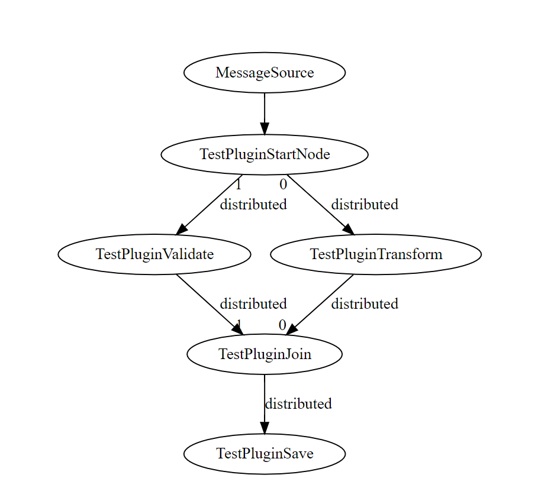

# hazelcast-jet-labs    

Hazelcast jet is a distributed stream processing engine. It can be used for low-latency streaming of events.
In this lab I'm evaluating if it can be used for processing cases/incoming messages in a case management system.

The idea is that Jet instances are very easy to deploy and allows the application to scale out painlessly. The
server can still be responsive for the clients even when processing large amounts of data/events. It could also
serve as a replacement to the process engine completely, as it's very easy to use and even supports visualizations with the
DOT format. 

It would be cool to use distributed tracing along with the js-viz library for realtime surveillance as the events
get passed through the system. By supporting the DOT format process designs can be shared bidirectionally from 
developers to system designers.
    
Performance wise Hazelcast Jet would potentially be a great improvement, the API's used could also be improved. By
keeping the whole case object in memory for example, it would be possible and very EASY to modify cases even
with deep hierarchies. When the process is started, the whole case tree is simply loaded into memory and transferred
between nodes. The size of a case is usually very small, as it's only textual data - documents doesn't need to be
included (but could of course).

    
##### Features

I spent a day on the lab and this is what was done.

- Using a custom datasource, the Hazelcast Queue to feed the DAG.
- Wrapping the low-level DAG core API's in a "ProcessBuilder"
- Creating a "pluginified" wrapper on top of the API's.
- Added distributed tracing using Hazelcast topics.


##### Stuff to think about

- Check out a complete case tree including it's hierarchy. (only ONCE per process)
- How should multiple processes per case be handled.
- How does fork/join work? any way to wait for another item to arrive?
- Hazelcast clustering really helps with messaging etc.
- Any way to provide callbacks when processes completes? (for stream sources)
- 1MB is around 75 _PAGES_ of paper, additionally text compresses very well.
- case objects may be persisted at any stage, controlled by the plugins.
- jobs can spawn other jobs, can jobs wait for external/other jobs?
- support for building charts from existing xml configuration?
- Pipeline is easy to use, DAG is harder - "pluginified" is easiest.
- jobs can be paused unpaused, with snapshot support.
- DAG's can be checked for errors without starting Jet.

https://docs.hazelcast.org/docs/jet/0.3.1/manual/Understanding_Jet_Architecture_and_API/Edge/Forwarding_Patterns.html

    
### Result

Using the API's to build a distributed process

```kotlin
fun process() {
    // create a builder to create the process
    val process = ProcessFactory.create<ProcessContextImpl, ObjectForProcessing>(ProcessContextImpl::class.java
    process.setName("MessageSource")
    
    process.vertex(TestPluginStartNode::class.java)
        .edge(TestPluginTransform::class.java)
        .edge(TestPluginValidate::class.java)

    // one of the fork paths
    process.vertex(TestPluginTransform::class.java)
        .edge(TestPluginJoin::class.java)

    // the second fork path
    process.vertex(TestPluginValidate::class.java)
        .edge(TestPluginJoin::class.java)

    // join node, forward to end node "save".
    process.vertex(TestPluginJoin::class.java)
        .edge(TestPluginSave::class.java)
}
```

Produces the following DOT output (`DAG#toDOTString()`)

```json
digraph DAG {
	"MessageSource" [tooltip="local-parallelism=1"];
	"TestPluginStartNode" [tooltip="local-parallelism=4"];
	"TestPluginValidate" [tooltip="local-parallelism=4"];
	"TestPluginTransform" [tooltip="local-parallelism=4"];
	"TestPluginJoin" [tooltip="local-parallelism=4"];
	"TestPluginSave" [tooltip="local-parallelism=4"];
	"MessageSource" -> "TestPluginStartNode";
	"TestPluginStartNode" -> "TestPluginTransform" [label="distributed", taillabel=0];
	"TestPluginStartNode" -> "TestPluginValidate" [label="distributed", taillabel=1];
	"TestPluginValidate" -> "TestPluginJoin" [label="distributed", headlabel=1];
	"TestPluginTransform" -> "TestPluginJoin" [label="distributed", headlabel=0];
	"TestPluginJoin" -> "TestPluginSave" [label="distributed"];
}
```

Which can be visualized on [viz-js.com](http://viz-js.com/) and looks like this



#### Conclusion

Hazelcast Jet is very cool, I started out with the `Pipeline` API but wanted to go deeper and using the `DAG` API directly. 
The hardest part was figuring out how to use custom data sources with this low-level API. It was much easier
using the `SourceBuilder` with the Pipeline API than creating one from `SourceProcessors`.

The result is pretty cool and easy, it pluginifies Hazelcast Jet which is nice for bigger operations I guess. :smiley_cat:

### Building

Build the project with

```console
gradlew jar
```

Run with 

```console
java -jar <jet-sample>.jar
```

The following output should appear

```$xslt
NOTE: Picked up JDK_JAVA_OPTIONS: --add-opens=java.base/java.lang=ALL-UNNAMED --add-opens=java.base/java.io=ALL-UNNAMED
--add-opens=java.base/java.util=ALL-UNNAMED --add-opens=java.base/sun.net.dns=ALL-UNNAMED --add-opens=java.base/java.lan
g.reflect=ALL-UNNAMED --add-opens=java.base/java.nio=ALL-UNNAMED --add-opens=java.base/sun.nio.ch=ALL-UNNAMED --add-open
s=java.base/java.net=ALL-UNNAMED
okt. 26, 2019 7:21:40 EM com.hazelcast.config.AbstractConfigLocator
INFO: Loading 'hazelcast-jet-default.xml' from the classpath.
okt. 26, 2019 7:21:40 EM com.hazelcast.jet.config.JetConfig
INFO: jet.home is C:\Users\chili\Documents\jet-sample\build\libs
okt. 26, 2019 7:21:40 EM com.hazelcast.config.AbstractConfigLocator
INFO: Loading 'hazelcast-jet-member-default.xml' from the classpath.
okt. 26, 2019 7:21:40 EM com.hazelcast.instance.HazelcastInstanceFactory
WARNING: Hazelcast is starting in a Java modular environment (Java 9 and newer) but without proper access to required Ja
va packages. Use additional Java arguments to provide Hazelcast access to Java internal API. The internal API access is
used to get the best performance results. Arguments to be used:
 --add-modules java.se --add-exports java.base/jdk.internal.ref=ALL-UNNAMED --add-opens java.base/java.lang=ALL-UNNAMED
--add-opens java.base/java.nio=ALL-UNNAMED --add-opens java.base/sun.nio.ch=ALL-UNNAMED --add-opens java.management/sun.
management=ALL-UNNAMED --add-opens jdk.management/com.sun.management.internal=ALL-UNNAMED
okt. 26, 2019 7:21:40 EM com.hazelcast.instance.AddressPicker
INFO: [LOCAL] [jet] [3.2] Prefer IPv4 stack is true, prefer IPv6 addresses is false
okt. 26, 2019 7:21:40 EM com.hazelcast.instance.AddressPicker
INFO: [LOCAL] [jet] [3.2] Picked [10.0.75.1]:5701, using socket ServerSocket[addr=/0:0:0:0:0:0:0:0,localport=5701], bind
 any local is true
okt. 26, 2019 7:21:40 EM com.hazelcast.system
INFO: [10.0.75.1]:5701 [jet] [3.2] Hazelcast Jet 3.2 (20191018 - 61a9fa1) starting at [10.0.75.1]:5701
okt. 26, 2019 7:21:40 EM com.hazelcast.system
INFO: [10.0.75.1]:5701 [jet] [3.2]
        o   o   o   o---o o---o o     o---o   o   o---o o-o-o        o o---o o-o-o
        |   |  / \     /  |     |     |      / \  |       |          | |       |
        o---o o---o   o   o-o   |     o     o---o o---o   |          | o-o     |
        |   | |   |  /    |     |     |     |   |     |   |      \   | |       |
        o   o o   o o---o o---o o---o o---o o   o o---o   o       o--o o---o   o
okt. 26, 2019 7:21:40 EM com.hazelcast.system
INFO: [10.0.75.1]:5701 [jet] [3.2] Copyright (c) 2008-2019, Hazelcast, Inc. All Rights Reserved.
okt. 26, 2019 7:21:41 EM com.hazelcast.spi.impl.operationservice.impl.BackpressureRegulator
INFO: [10.0.75.1]:5701 [jet] [3.2] Backpressure is disabled
okt. 26, 2019 7:21:41 EM com.hazelcast.instance.Node
INFO: [10.0.75.1]:5701 [jet] [3.2] Creating MulticastJoiner
okt. 26, 2019 7:21:42 EM com.hazelcast.jet.impl.execution.TaskletExecutionService
INFO: [10.0.75.1]:5701 [jet] [3.2] Creating idler with jet.idle.cooperative.min.microseconds=25Ás,jet.idle.cooperative.max.microseconds=500Ás
okt. 26, 2019 7:21:42 EM com.hazelcast.jet.impl.execution.TaskletExecutionService
INFO: [10.0.75.1]:5701 [jet] [3.2] Creating idler with jet.idle.noncooperative.min.microseconds=25Ás,jet.idle.noncooperative.max.microseconds=5000Ás
okt. 26, 2019 7:21:42 EM com.hazelcast.jet.impl.metrics.JetMetricsService
INFO: [10.0.75.1]:5701 [jet] [3.2] Configuring metrics collection, collection interval=5 seconds, retention=5 seconds, publishers=[Management Center Publisher, Job Metrics Publisher, JMX Publish
er]
okt. 26, 2019 7:21:42 EM com.hazelcast.jet.impl.JetService
INFO: [10.0.75.1]:5701 [jet] [3.2] Setting number of cooperative threads and default parallelism to 4
okt. 26, 2019 7:21:42 EM com.hazelcast.spi.impl.operationexecutor.impl.OperationExecutorImpl
INFO: [10.0.75.1]:5701 [jet] [3.2] Starting 4 partition threads and 3 generic threads (1 dedicated for priority tasks)
okt. 26, 2019 7:21:42 EM com.hazelcast.internal.diagnostics.Diagnostics
INFO: [10.0.75.1]:5701 [jet] [3.2] Diagnostics disabled. To enable add -Dhazelcast.diagnostics.enabled=true to the JVM arguments.
okt. 26, 2019 7:21:42 EM com.hazelcast.core.LifecycleService
INFO: [10.0.75.1]:5701 [jet] [3.2] [10.0.75.1]:5701 is STARTING
okt. 26, 2019 7:21:44 EM com.hazelcast.internal.cluster.ClusterService
INFO: [10.0.75.1]:5701 [jet] [3.2]

Members {size:1, ver:1} [
        Member [10.0.75.1]:5701 - 44439093-250f-4477-8df6-558ee6af7c87 this
]

okt. 26, 2019 7:21:44 EM com.hazelcast.core.LifecycleService
INFO: [10.0.75.1]:5701 [jet] [3.2] [10.0.75.1]:5701 is STARTED
okt. 26, 2019 7:21:44 EM com.hazelcast.internal.partition.impl.PartitionStateManager
INFO: [10.0.75.1]:5701 [jet] [3.2] Initializing cluster partition table arrangement...
okt. 26, 2019 7:21:44 EM com.hazelcast.jet.impl.JobCoordinationService
INFO: [10.0.75.1]:5701 [jet] [3.2] Starting job 0356-8480-eac0-0001 based on submit request
okt. 26, 2019 7:21:44 EM com.hazelcast.jet.impl.MasterJobContext
INFO: [10.0.75.1]:5701 [jet] [3.2] Didn't find any snapshot to restore for job '0356-8480-eac0-0001', execution 0356-8480-eac1-0001
okt. 26, 2019 7:21:44 EM com.hazelcast.jet.impl.MasterJobContext
INFO: [10.0.75.1]:5701 [jet] [3.2] Start executing job '0356-8480-eac0-0001', execution 0356-8480-eac1-0001, execution graph in DOT format:
digraph DAG {
        "MessageSource" [tooltip="local-parallelism=1"];
        "TestPluginStartNode" [tooltip="local-parallelism=4"];
        "TestPluginValidate" [tooltip="local-parallelism=4"];
        "TestPluginTransform" [tooltip="local-parallelism=4"];
        "TestPluginJoin" [tooltip="local-parallelism=4"];
        "TestPluginSave" [tooltip="local-parallelism=4"];
        "MessageSource" -> "TestPluginStartNode";
        "TestPluginStartNode" -> "TestPluginTransform" [label="distributed", taillabel=0];
        "TestPluginStartNode" -> "TestPluginValidate" [label="distributed", taillabel=1];
        "TestPluginValidate" -> "TestPluginJoin" [label="distributed", headlabel=1];
        "TestPluginTransform" -> "TestPluginJoin" [label="distributed", headlabel=0];
        "TestPluginJoin" -> "TestPluginSave" [label="distributed"];
}
HINT: You can use graphviz or http://viz-js.com to visualize the printed graph.
okt. 26, 2019 7:21:45 EM com.hazelcast.jet.impl.JobExecutionService
INFO: [10.0.75.1]:5701 [jet] [3.2] Execution plan for jobId=0356-8480-eac0-0001, jobName='0356-8480-eac0-0001', executionId=0356-8480-eac1-0001 initialized
okt. 26, 2019 7:21:45 EM com.hazelcast.jet.impl.JobExecutionService
INFO: [10.0.75.1]:5701 [jet] [3.2] Start execution of job '0356-8480-eac0-0001', execution 0356-8480-eac1-0001 from coordinator [10.0.75.1]:5701
started processing first
okt. 26, 2019 7:21:45 EM logging
INFO: [10.0.75.1]:5701 [jet] [3.2] running plugin com.github.codingchili.plugins.TestPluginStartNode on machine DESKTOP-TDNIONG
processing first_TRANSFORMED
processing first_TRANSFORMED
saved pojo name: first_TRANSFORMED, ref: $/root/cases/stuff/, objs: [two, three, one]
saved pojo name: first_TRANSFORMED, ref: $/root/cases/stuff/, objs: [two, three, one]
okt. 26, 2019 7:21:45 EM logging
INFO: [10.0.75.1]:5701 [jet] [3.2] running plugin com.github.codingchili.plugins.TestPluginTransform on machine DESKTOP-TDNIONG
okt. 26, 2019 7:21:45 EM logging
INFO: [10.0.75.1]:5701 [jet] [3.2] running plugin com.github.codingchili.plugins.TestPluginValidate on machine DESKTOP-TDNIONG
okt. 26, 2019 7:21:45 EM logging
INFO: [10.0.75.1]:5701 [jet] [3.2] running plugin com.github.codingchili.plugins.TestPluginJoin on machine DESKTOP-TDNIONG
okt. 26, 2019 7:21:45 EM logging
INFO: [10.0.75.1]:5701 [jet] [3.2] running plugin com.github.codingchili.plugins.TestPluginJoin on machine DESKTOP-TDNIONG
okt. 26, 2019 7:21:45 EM logging
INFO: [10.0.75.1]:5701 [jet] [3.2] running plugin com.github.codingchili.plugins.TestPluginSave on machine DESKTOP-TDNIONG
okt. 26, 2019 7:21:45 EM logging
INFO: [10.0.75.1]:5701 [jet] [3.2] running plugin com.github.codingchili.plugins.TestPluginSave on machine DESKTOP-TDNIONG
started processing second
okt. 26, 2019 7:21:46 EM logging
INFO: [10.0.75.1]:5701 [jet] [3.2] running plugin com.github.codingchili.plugins.TestPluginStartNode on machine DESKTOP-TDNIONG
okt. 26, 2019 7:21:46 EM logging
INFO: [10.0.75.1]:5701 [jet] [3.2] running plugin com.github.codingchili.plugins.TestPluginTransform on machine DESKTOP-TDNIONG
processing second_TRANSFORMEDokt. 26, 2019 7:21:46 EM logging
INFO: [10.0.75.1]:5701 [jet] [3.2] running plugin com.github.codingchili.plugins.TestPluginJoin on machine DESKTOP-TDNIONG

okt. 26, 2019 7:21:46 EM logging
INFO: [10.0.75.1]:5701 [jet] [3.2] running plugin com.github.codingchili.plugins.TestPluginValidate on machine DESKTOP-TDNIONG
saved pojo name: second_TRANSFORMED, ref: $/root/cases/stuff/, objs: [two, three, one]okt. 26, 2019 7:21:46 EM logging
INFO: [10.0.75.1]:5701 [jet] [3.2] running plugin com.github.codingchili.plugins.TestPluginSave on machine DESKTOP-TDNIONG

processing second_TRANSFORMED
okt. 26, 2019 7:21:46 EM logging
INFO: [10.0.75.1]:5701 [jet] [3.2] running plugin com.github.codingchili.plugins.TestPluginJoin on machine DESKTOP-TDNIONG
okt. 26, 2019 7:21:46 EM logging
INFO: [10.0.75.1]:5701 [jet] [3.2] running plugin com.github.codingchili.plugins.TestPluginSave on machine DESKTOP-TDNIONG
saved pojo name: second_TRANSFORMED, ref: $/root/cases/stuff/, objs: [two, three, one]
started processing third
okt. 26, 2019 7:21:48 EM logging
INFO: [10.0.75.1]:5701 [jet] [3.2] running plugin com.github.codingchili.plugins.TestPluginStartNode on machine DESKTOP-TDNIONG
okt. 26, 2019 7:21:48 EM logging
INFO: [10.0.75.1]:5701 [jet] [3.2] running plugin com.github.codingchili.plugins.TestPluginValidate on machine DESKTOP-TDNIONG
processing third_TRANSFORMEDokt. 26, 2019 7:21:48 EM logging
INFO: [10.0.75.1]:5701 [jet] [3.2] running plugin com.github.codingchili.plugins.TestPluginTransform on machine DESKTOP-TDNIONG

okt. 26, 2019 7:21:48 EM logging
INFO: [10.0.75.1]:5701 [jet] [3.2] running plugin com.github.codingchili.plugins.TestPluginJoin on machine DESKTOP-TDNIONG
processing third_TRANSFORMEDokt. 26, 2019 7:21:48 EM logging
INFO: [10.0.75.1]:5701 [jet] [3.2] running plugin com.github.codingchili.plugins.TestPluginJoin on machine DESKTOP-TDNIONG
okt. 26, 2019 7:21:48 EM logging
INFO: [10.0.75.1]:5701 [jet] [3.2] running plugin com.github.codingchili.plugins.TestPluginSave on machine DESKTOP-TDNIONG

saved pojo name: third_TRANSFORMED, ref: $/root/cases/stuff/, objs: [two, three, one]okt. 26, 2019 7:21:48 EM logging
INFO: [10.0.75.1]:5701 [jet] [3.2] running plugin com.github.codingchili.plugins.TestPluginSave on machine DESKTOP-TDNIONG

saved pojo name: third_TRANSFORMED, ref: $/root/cases/stuff/, objs: [two, three, one]
```

